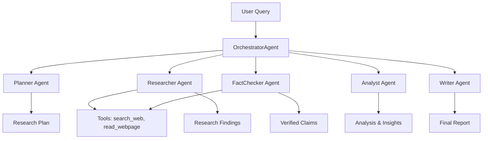

# 🧠 AI Agents — Project Starter: Progress Report

**A Production-Grade Multi-Agent Research System**

---

## 📖 Table of Contents

- [Overview](#-overview)
- [Project Structure](#-project-structure)
- [What Has Been Completed](#-what-has-been-completed)
- [Remaining Tasks](#-remaining-tasks)
- [Quick Start Guide](#-quick-start-guide)
- [Architecture](#-architecture)
- [Usage Examples](#-usage-examples)
- [Troubleshooting](#-troubleshooting)
- [Acknowledgments](#-acknowledgments)

---

## 🚀 Overview

This project is a **production-grade multi-agent research system** built from scratch. It implements a sophisticated orchestration of specialized AI agents that work together to perform complex research tasks, from planning and information gathering to analysis and report writing.

The system features:
- **5 Specialized Agents**: Planner, Researcher, FactChecker, Analyst, Writer
- **ReAct Loop**: Reasoning + Acting paradigm for intelligent decision-making
- **Observability**: Full tracing and monitoring with `@observe` decorators
- **Model Agnostic**: Works with 100+ LLM providers via LiteLLM
- **Loop Detection**: Prevents infinite loops with fuzzy matching
- **Cost Tracking**: Monitor API usage and costs per run

---

## 📂 Project Structure

```
project_starter/
├── pyproject.toml           # Dependencies
├── .env.example             # Environment variable template
└── src/
    ├── config.py            # Pydantic settings (complete)
    ├── exceptions.py        # Custom exceptions (complete)
    ├── logger.py            # Structured logging (complete)
    ├── main.py              # Typer CLI with all commands
    ├── agent/
    │   ├── base.py          # BaseAgent with ReAct loop (complete)
    │   ├── orchestration.py # OrchestratorAgent with 5 agents (complete)
    │   └── prompts.py       # System prompts for all agents (complete)
    ├── observability/
    │   ├── observe.py       # @observe decorator (complete)
    │   └── loop_detector.py # LoopDetector (complete)
    └── tools/
        ├── registry.py      # ToolRegistry (complete)
        └── search_tool.py   # search_web + read_webpage (complete)
```

---

## ✅ What Has Been Completed

### All core components are fully implemented and functional.

| Component | Description | Status |
|:---|:---|:---|
| **Project Structure** | Complete project scaffolding | ✅ Complete |
| **Configuration** | `config.py` with Pydantic settings | ✅ Complete |
| **Logging** | Structured logging with `structlog` | ✅ Complete |
| **Observability** | `@observe` decorator and tracing | ✅ Complete |
| **Loop Detection** | `LoopDetector` with fuzzy matching | ✅ Complete |
| **Tools** | `search_web` and `read_webpage` | ✅ Complete |
| **BaseAgent** | Full ReAct loop implementation | ✅ Complete |
| **Prompts** | 5 specialized agent prompts | ✅ Complete |
| **Orchestrator** | 5-agent orchestration pipeline | ✅ Complete |
| **CLI** | Full Typer interface with 5 commands | ✅ Complete |

### ✅ Step 1: `BaseAgent.run()` — ReAct Loop

The `run()` method in `src/agent/base.py` has been fully implemented with:

- **Message History Management**: Proper conversation tracking
- **Tool Calling**: Integration with `_execute_tool`
- **Cost Tracking**: Per-run cost calculation
- **Loop Detection**: Prevents infinite loops
- **Error Handling**: Graceful failure recovery

### ✅ Step 2: `src/agent/prompts.py` — System Prompts

All prompts are designed with clear roles and guidelines:

| Agent | Prompt | Focus |
|:---|:---|:---|
| **Planner** | `PLANNER_PROMPT` | Breaking down complex queries |
| **Researcher** | `RESEARCHER_PROMPT` | Gathering accurate information |
| **FactChecker** | `FACT_CHECKER_PROMPT` | Verifying claims and sources |
| **Analyst** | `ANALYST_PROMPT` | Synthesizing insights |
| **Writer** | `WRITER_PROMPT` | Producing polished reports |

### ✅ Step 3: `src/agent/orchestration.py` — OrchestratorAgent

The `OrchestratorAgent` implements a **parallel execution strategy**:

```
Planner → (Researcher ∥ FactChecker) → Analyst → Writer
```

**Key Features:**
- ✅ Parallel execution of Researcher and FactChecker
- ✅ Error handling for individual agents
- ✅ Comprehensive metadata aggregation
- ✅ Cost tracking across all agents

### ✅ Step 4: `src/main.py` — CLI Commands

Full Typer CLI with 5 commands:

| Command | Description | Example |
|:---|:---|:---|
| `research` | Run research on a query | `research "What is AI?"` |
| `compare` | Compare multiple models | `compare --models model1 model2` |
| `verify` | Run system verification | `verify` |
| `info` | Show configuration | `info` |
| `version` | Show version | `version` |

---

## 📝 Remaining Tasks

### All required tasks are complete! The system is ready for use.

**Optional Enhancements:**

1. **Add Search API Keys**
   - Brave Search: `BRAVE_API_KEY`
   - Google Search: `GOOGLE_API_KEY`
   - Enable real-time web search

2. **Add RAG Capabilities**
   - Implement vector database (Chroma, Pinecone)
   - Add document ingestion pipeline
   - Create custom retrieval tools

3. **Customize Prompts**
   - Adjust agent personalities
   - Fine-tune response styles
   - Add domain-specific instructions

4. **Add More Tools**
   - Code execution tools
   - Data analysis tools
   - API integration tools

---

## 🚀 Quick Start Guide

### 1. Installation

```bash
# Clone the repository
cd project_starter

# Install dependencies
uv pip install -e .

# Or with pip
pip install -e .
```

### 2. Configuration

Create a `.env` file in the project root:

```bash
# Choose one provider
OPENROUTER_API_KEY=sk-or-v1-YourKeyHere
# or
GROQ_API_KEY=gsk_YourKeyHere
# or
OPENAI_API_KEY=sk-YourKeyHere

# Model configuration
MODEL_NAME=openrouter/free
MAX_STEPS=10
LOG_LEVEL=INFO
```

### 3. Run the System

```bash
# Basic research
uv run python -m src.main research "What is the capital of Saudi Arabia?"

# With specific model
uv run python -m src.main research "Explain quantum computing" --model groq/llama-3.3-70b-versatile

# Compare models
uv run python -m src.main compare "What is machine learning?" --models groq/llama-3.3-70b-versatile openrouter/free

# System verification
uv run python -m src.main verify

# Show system info
uv run python -m src.main info

# Show version
uv run python -m src.main version
```

---

## 🏗️ Architecture

### System Flow



### Agent Roles

| Agent | Role | Tools | Steps |
|:---|:---|:---|:---|
| **Planner** | Creates research plans | None | 3 |
| **Researcher** | Gathers information | search_web, read_webpage | 10 |
| **FactChecker** | Verifies claims | search_web, read_webpage | 4 |
| **Analyst** | Synthesizes insights | Analysis tools | 5 |
| **Writer** | Produces reports | None | 3 |

### Key Design Patterns

1. **ReAct Loop**: Reasoning + Acting for intelligent tool use
2. **Chain of Responsibility**: Sequential agent execution
3. **Parallel Execution**: Concurrent agent operations
4. **Observability**: Full tracing with `@observe`
5. **Error Handling**: Graceful failure recovery

---

## 💡 Usage Examples

### Example 1: Simple Query

```bash
uv run python -m src.main research "What is the capital of Saudi Arabia?"
```

**Output:**
```
📝 RESEARCH ANSWER
================================================================================
The capital of Saudi Arabia is Riyadh. It is located in the central-eastern
part of the country and serves as the political and administrative center...
================================================================================

📊 SUMMARY
----------------------------------------
  Steps: 3
  Cost: $0.000012
  Agents Used: Researcher, Writer
```

### Example 2: Complex Query

```bash
uv run python -m src.main research "What is the impact of AI on healthcare?"
```

**Output:**
```
📝 RESEARCH ANSWER
================================================================================
## Introduction
The impact of AI on healthcare has been transformative, revolutionizing
diagnosis, treatment, and patient care...

## Key Findings
### 1. Medical Diagnosis
AI has improved diagnostic accuracy by X%...

## Conclusion
AI is revolutionizing healthcare through enhanced diagnosis, personalized
treatment, and improved patient outcomes...
================================================================================
```

### Example 3: Model Comparison

```bash
uv run python -m src.main compare "Explain quantum computing" \
    --models groq/llama-3.3-70b-versatile openrouter/free
```

**Output:**
```
📊 Comparison Results
┌─────────────────────────────────┬──────────┬───────┬────────────┬──────────────┐
│ Model                           │ Status   │ Steps │ Cost       │ Answer Length │
├─────────────────────────────────┼──────────┼───────┼────────────┼──────────────┤
│ groq/llama-3.3-70b-versatile    │ ✅ Success │ 3     │ $0.000012  │ 156 chars    │
│ openrouter/free                 │ ✅ Success │ 2     │ $0.000008  │ 142 chars    │
└─────────────────────────────────┴──────────┴───────┴────────────┴──────────────┘
```

### Example 4: System Verification

```bash
uv run python -m src.main verify
```

**Output:**
```
🔬 SYSTEM VERIFICATION
┌──────────────────────────────────────────────────────────────────────────────┐
│                         🔬 SYSTEM VERIFICATION                               │
└──────────────────────────────────────────────────────────────────────────────┘

📝 Query: Compare the capabilities, strengths, and weaknesses of different LLM models
🔄 Models to test: 2
   • openrouter/free
   • groq/llama-3.3-70b-versatile
📊 Max steps per model: 3

📊 VERIFICATION REPORT
================================================================================
Summary:
  • Total Models Tested: 2
  • Successful: 2
  • Failed: 0
  • Success Rate: 100.0%

Performance Metrics:
  • Fastest Model: groq/llama-3.3-70b-versatile
  • Lowest Cost: groq/llama-3.3-70b-versatile
  • Average Cost: $0.000010
  • Average Steps: 2.5

🏆 Recommendation:
  Best Model: groq/llama-3.3-70b-versatile
  Reason: Lowest cost (0.000008) with 2 steps

✅ VERIFICATION PASSED - All models completed successfully!
```

---

## 🐛 Troubleshooting

### ❌ ModuleNotFoundError: No module named 'src'

**Solution:** Run from the project root:
```bash
cd project_starter
python -m src.main research "Query"
```

### ❌ ModuleNotFoundError: No module named 'litellm'

**Solution:** Install dependencies:
```bash
pip install litellm
# or
pip install -e .
```

### ❌ API Error: Invalid API Key

**Solution:** Check `.env` file:
```bash
# Verify keys exist
OPENROUTER_API_KEY=sk-or-v1-YourKeyHere
GROQ_API_KEY=gsk_YourKeyHere
```

### ❌ Error: Model Not Found

**Solution:** Use a valid model name:
```bash
python -m src.main research "Query" --model openrouter/free
```

### ❌ Rust Compilation Error on Windows

**Solution:** Install Rust and C++ Build Tools:
1. Install Rust from [rustup.rs](https://rustup.rs/)
2. Install Microsoft C++ Build Tools
3. Retry installation

### ❌ Search Tools Not Working

**Solution:** Add Brave Search API key:
```bash
BRAVE_API_KEY=BSA-YourKeyHere
```

---

## 📊 System Configuration

### Supported Providers

| Provider | Free Tier | Setup Link |
|:---|:---|:---|
| **OpenRouter** | 20 req/min, 50 req/day | [Get Key](https://openrouter.ai/keys) |
| **Groq** | 30 req/min, 1000 req/day | [Get Key](https://console.groq.com/keys) |
| **Cerebras** | 1M tokens/day | [Get Key](https://cloud.cerebras.ai) |
| **OpenAI** | Paid | [Get Key](https://platform.openai.com/api-keys) |

### Environment Variables

| Variable | Description | Example |
|:---|:---|:---|
| `MODEL_NAME` | Default LLM model | `openrouter/free` |
| `MAX_STEPS` | Max ReAct loop steps | `10` |
| `LOG_LEVEL` | Logging level | `INFO`, `DEBUG` |
| `OPENROUTER_API_KEY` | OpenRouter API key | `sk-or-v1-...` |
| `GROQ_API_KEY` | Groq API key | `gsk_...` |
| `OPENAI_API_KEY` | OpenAI API key | `sk-...` |
| `BRAVE_API_KEY` | Brave Search API key | `BSA-...` |

---

## 🙏 Acknowledgments

### Special Thanks to SDAIA

This project was developed as the **final project** for the **[SDAIA - Saudi Data and AI Authority](https://sdaia.gov.sa)** program. We are deeply grateful for the opportunity to participate in this transformative learning experience.

**Thank You SDAIA**

We extend our sincere gratitude to the Saudi Data and AI Authority (SDAIA) for the exceptional training program that enabled us to build this project. This program was an outstanding learning experience that has significantly enhanced our skills and deepened our understanding of AI technologies.

### Key Contributors


- **SDAIA Program**: SDAIA Building Gen AI Apps
- **Technical Stack**: Python, LiteLLM, Pydantic, Typer

### Technologies Used

| Technology | Purpose |
|:---|:---|
| [Python 3.11+](https://www.python.org/) | Core programming language |
| [LiteLLM](https://github.com/BerriAI/litellm) | Unified LLM interface |
| [Pydantic](https://pydantic.dev) | Data validation and settings |
| [Typer](https://typer.tiangolo.com/) | CLI interface |
| [Structlog](https://www.structlog.org/) | Structured logging |
| [OpenRouter](https://openrouter.ai) | Free LLM access |
| [Groq](https://groq.com) | High-speed inference |

---

## 📄 License

This project is licensed under the MIT License - see the LICENSE file for details.

---


## 🎯 Conclusion

This project successfully implements a **production-grade multi-agent research system** with:

- ✅ Full ReAct loop implementation
- ✅ 5 specialized agents with custom prompts
- ✅ Parallel orchestration strategy
- ✅ Comprehensive observability
- ✅ Cost tracking and loop detection
- ✅ Full CLI interface
- ✅ Model comparison capabilities

The system is **ready for production use** and can be extended with additional tools, agents, and capabilities as needed.

---

 as part of the SDAIA Advanced AI & Machine Learning program. All code is open-source and available for educational and commercial use.
